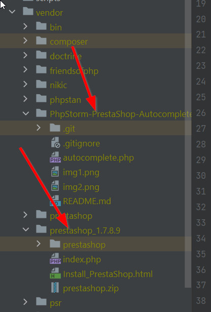
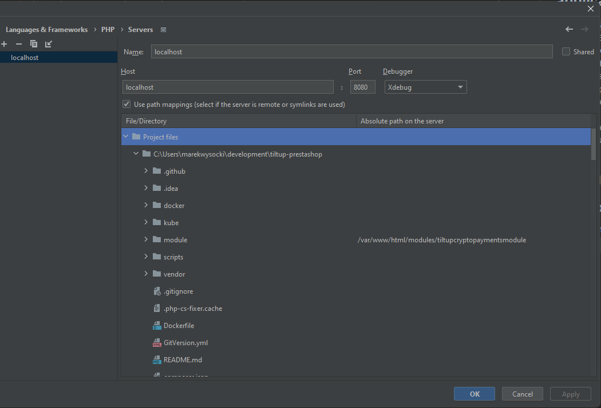

# tiltup-prestashop

TiltUp Prestashop plugin

## Local env setup

### Windows

1. Clone this repo
2. Download & install [Xampp](https://sourceforge.net/projects/xampp/files/XAMPP%20Windows/7.4.33/) as local PHP
   interpreter.
3. Download & install [Composer](https://getcomposer.org/download/) (use the installer)
4. Download & unzip [Prestashop release](https://github.com/PrestaShop/PrestaShop/releases/tag/1.7.8.9) to a dedicated folder. Unzip the `prestashop.zip` file inside as well.
   - copy the content of this folder to the `vendor` folder
5. Clone [the PrestaShop-Autocomplete repo](https://github.com/julienbourdeau/PhpStorm-PrestaShop-Autocomplete)
   - copy the content of it to the `vendor` folder 



## Bootstrapping the application

1. `composer install`
2. `composer up` will spin up a Dockerized MariaDB & Prestashop instance.
3. The repo folder is mounted onto the Prestashop container (aka hot reload), so all your changes will be immediately
   reflected in the shop.
4. Navigate to `localhost:8080` to access your shop.
5. Navigate to `localhost:8080/admin-dev` to access admin panel.

info about credentials is [in confluence](https://tilt-up.atlassian.net/wiki/spaces/TP/pages/92438529/E-Commerce+stores+testing#PrestaShop)
## Debugging

### IntelliJ IDEA

1. Install the official PHP Plugin.
2. The local container already comes with Xdebug enabled, so no extra config needed.
3. Setup server and path mappings as follows:
4. Click `Start listening to PHP Debug Connections` to start debugging.

## Prestashop

### Module installation

The module is installed by a post-install script. However, it can also be installed/uninstalled from command line:

```shell
php bin/console prestashop:module install tiltupcryptopaymentsmodule
```

```shell
php bin/console prestashop:module uninstall tiltupcryptopaymentsmodule
```

### Module configuration

1. Navigate to Admin -> Modules -> Module Manager.
2. Search for `tiltup` and click `Configure`.

## Useful links

- [Presta docs](https://devdocs.prestashop-project.org/1.7/modules/creation/tutorial/)
- [Official payment module skeleton](https://github.com/PrestaShop/paymentexample)
- [Blumedia payment module](https://github.com/bluepayment-plugin/prestashop-plugin-1.7)
- [PayU payment module](https://github.com/PayU-EMEA/plugin_prestashop)
- [PayNow payment module](https://github.com/pay-now/paynow-prestashop)
